# TL07 - Boost your AEM Search

## Agenda
[Chapter 01 - Boostrap](#chapter-01---bootstrap)  
[Chapter 02 - Search fundamentals](#chapter-02---search-fundamentals)  
[Chapter 03 - Suggestions](#chapter-03---suggestions)  
[Chapter 04 - Spellcheck](#chapter-04---spellcheck)  
[Chapter 05 - Analyzers](#chapter-05---analyzers)  
[Chapter 06 - Boosting](#chapter-06---boosting)  
[Chapter 07 - Smart Tags](#chapter-07---smart-tags)  
[Chapter 08 - Smart Translation](#chapter-08---smart-translation)  
[Solution Packages](#solution-packages)  

## Chapter 01 - Bootstrap

### AEM Start
Start AEM by executing the following steps

1. Open a terminal window and navigate to path `/Users/tl07/Desktop/aem-6.4-summit-london`
2. Execute the following command

```java -Xmx6G -jar cq-quickstart-*.jar -nobrowser -nofork```

3. Using Chrome, log in to AEM Author at http://localhost:4502/
* User name: admin
* Password: admin

### Developer Tools

#### Query Performance & Explain Query
Web tool that lists recent slow and popular queries and provides detailed execution details for a specific query.
- AEM > Tools > Operations > Diagnosis > [Query Performance](http://localhost:4502/libs/granite/operations/content/diagnosistools/queryPerformance.html)

#### :information_source: Re-indexing Oak Indexes
Throughout this lab, re-indexing of the /oak:index/damAssetLucene will be required to make configuration changes to take effect.  

Below are the steps required to re-index the damAssetLucene index.
1. Open the */oak:index/damAssetLucene* node in [CRXDE Lite](http://localhost:4502/crx/de/index.jsp#/oak%3Aindex/damAssetLucene)
2. Set *reindex* property to `true`
3. Once re-index finished, the *reindex* property value must be equal to **false** and *reindexCount* incremented

## Chapter 02 - Search fundamentals
AEM search supports robust full-text search, provided by the Apache Lucene. 

Lucene property indixes are at the core of AEM Search and must be well understood. This exercise covers:

*	Definition of the OOTB damAssetLucene Oak Lucene property index
*	Search query inspection
*	Full-text search operators

### :computer: Perform a full-text search on Assets
1. Navigate to AEM > Assets > [File](http://localhost:4502/assets.html/content/dam)
2. Select Filter on the left (Alt+5 shortcut can be used)

3. Filter by Files only (and not Folders) and type the term *mountain*

4. Find the executed query in the **Popular Queries** tab of [Query Performance](http://localhost:4502/libs/granite/operations/content/diagnosistools/queryPerformance.html) 

5. Select the query, click on :question:`Explain` and analyze the execution plan. The plan describes which Oak index will be used to execute this query; in this case the Lucene index named **damAssetLucene** is selected for use.


### :computer: Inspecting the damAssetLucene index definition
1.	Open [CRXDE Lite](http://localhost:4502/crx/de)
2.	Select /oak:index/damAssetLucene node
3.	Core index configurations are on damAssetLucene 
4.	Full-text aggregate configuration are defined under damAssetLucene/aggregates
5.	Property specific configurations are defined under damAssetLucene/indexRules


### :computer: Full-text operations
Try out the following full-text searches using the supported operators and note the changes in results:
1. Group phrases: `mountain biking`
2. Group phrases with using double-quotes: `"mountain biking"`
3. OR operator: `mountain OR biking`
4. AND operator: `mountain AND biking`

## Chapter 03 - Suggestions
Suggestions provide list of terms or phrases that exist in the content and match a user-provided initial search term.  
There are two types of suggestion configurations:
1. Property-based: returns the entire value (multi-word) of a property as a suggested term
2. Aggregate-based: returns a list of single-word terms that match the user-provided search term

### :computer: Validate search suggestions
1. Navigate to AEM > Assets > [File](http://localhost:4502/assets.html/content/dam)
2. Click on the Search button and type the term `trail`
3. Verify AEM is providing suggestions for potential matching results

4. In this example, we observe property-based suggestions. *dc:title* and *dc:description* asset properties are configured to provide suggestion inputs. The configuration is done in the *damAssetLucene* index. The boolean property **useInSuggest** must be equal to *true*


### :computer: Configure search suggestions
1. Navigate to AEM > Assets > [File](http://localhost:4502/assets.html/content/dam)
2. Create a folder named `Aviation`
3. Enter this new folder and upload this image: [Big Airliner](images/airline_engine.jpg)
4. Click on the Search button and type term `airliner`

:information_source: We can observe that no suggestions are provided. Indeed, the default update frequency is set to 10 minutes

5. Open [CRXDE Lite](http://localhost:4502/crx/de) and select */oak:index/damAssetLucene* node
6. Create child node `suggestion` of type *nt:unstructured*
7. Add property `suggestUpdateFrequencyMinutes` of type *Long* with value equals to `1` 

8. Select */oak:index/damAssetLucene* node and add property `refresh` of type *Boolean* with value equals to `true`
9. Save changes and refresh the node *damAssetLucene*, we can should observe disappearing the *refresh* property

:information_source: There would be some cases where changes in index definition does not require a full reindex. For e.g. if a new property is being introduced in content model and no prior content exist with such a property then its safe to index such a property without doing a reindex

10. After maximum 1 minute, you should see suggestions for term *airliner*

11. Select again */oak:index/damAssetLucene/suggestion* and add property `suggestAnalyzed` of type *Boolean* with value equals to `true`

12. Select */oak:index/damAssetLucene* node and change `reindex` property value to `true`
13. Save changes and refresh the node *damAssetLucene*, once re-index done the *reindex* property value must be equal to **false** and *reindexCount* incremented
14. After maximum 1 minute, you should see aggregate-based suggestions for terms *airliner*, *big* or even *sky*


### :computer: Solution

### :information_source: Suggestion query
For getting suggestion terms, the following query can be used to retrieve values:
```sql
SELECT rep:suggest() FROM [nt:base] WHERE SUGGEST('airliner') AND ISDESCENDANTNODE('/content/dam')
```
More informations can be found in [OAK documentation](https://jackrabbit.apache.org/oak/docs/query/lucene.html#Suggestions)  

## Chapter 04 - Spellcheck
Spellcheck provides list of terms that exist in the content for user typed inputs that doesn't exactly match. It's mainly used to fix user typos by providing suggestions that will help them maximize results. By default the spellcheck is disabled in AEM.

### :computer: Configure spellcheck
1. Open [OSGi configurations](http://localhost:4502/system/console/configMgr) 
2. Search for the configuration [com.adobe.granite.omnisearch.impl.core.OmniSearchServiceImpl.name](http://localhost:4502/system/console/configMgr/com.adobe.granite.omnisearch.impl.core.OmniSearchServiceImpl)
3. Activate the option `Include spellcheck in suggestions`


:information_source: Note this configuration defines also the min text length for suggestions

4. As for previous suggestions, *dc:title* and *dc:description* asset properties are configured to provide spellcheck inputs. The configuration is done in the *damAssetLucene* index. The boolean property **useInSpellcheck** must be equal to *true*
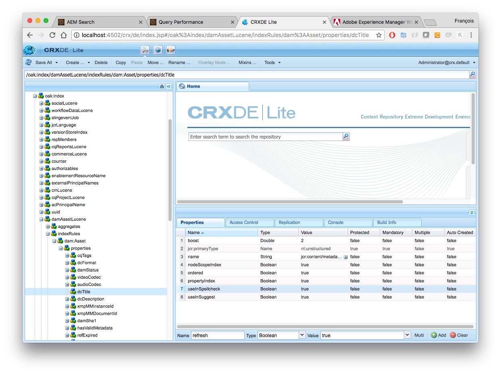

### :computer: Validate spellcheck suggestions
1. By default, TouchUI interface doesn't display spellcheck suggestions in Omnisearch feature
2. Navigate to AEM > Assets > [File](http://localhost:4502/assets.html/content/dam) 
3. Open Chrome Developer Tools and select the *Network* tab
4. Click on the Search button and type term `skying` (note the typo)
5. If we analyze the *omnisearch* request response, we can observe the *spellcheckSuggestion* JSON object containing a suggestion
```json
{  
   "availableModules":[  
      {  
         "name":"Assets",
         "contentNodePath":"/libs/granite/omnisearch/content/metadata/asset",
         "id":"asset"
      }
   ],
   "spellcheckSuggestion":[  
      "skiing"
   ]
}
```

### :computer: Display spellcheck suggestions
We are going to customize the TouchUI interface to display to Author users spellcheck suggestions. The file /libs/granite/ui/components/shell/clientlibs/shell/js/omnisearch.js must be customized with the following changes:
```javascript
// Line 424
if (target.spellcheckSuggestion) {
    input.value = target.spellcheckSuggestion;
} else {
    input.value = target.value || target.content.textContent;
}  
```
```javascript
// Line 552
else  if (itemsAddedCount < MAX_SUGGESTIONS && data.spellcheckSuggestion) {
	data.spellcheckSuggestion.some(function(item, index) {
        buttonList.items.add({
            value: item,
            content: {
                innerHTML: "<span class='u-coral-text-secondary'>Do you mean: " + item + "</span>"
            }
        });

        return ++itemsAddedCount >= MAX_SUGGESTIONS;
    });
}
```

1. Open Package Manager in [CRXDE Lite](http://localhost:4502/crx/packmgr/index.jsp) 
2. Install the [Chapter 04 - Spellcheck-1.0.0.zip](resources/Chapter%2004%20-%20Spellcheck-1.0.0.zip) package
3. Click on the Search button and type term `skying`


### :information_source: Spellcheck query
For getting spellcheck suggestion terms, the following query can be used to retrieve values:
```sql
SELECT rep:spellcheck() FROM [nt:base] WHERE SPELLCHECK('skying') AND ISDESCENDANTNODE('/content/dam')
```
More informations can be found in [OAK documentation](https://jackrabbit.apache.org/oak/docs/query/lucene.html#Spellchecking)

## Chapter 05 - Analyzers
AEM search allows Analyzers to be configured per index. Analyzers dictate how content is indexed into the search indices, and can also augment how queries are executed against them. This exercise set up among other Synonyms, Stemming, Stop words and HTML Stripping.

### Initial Structure
To understand how text analysis works, we need to understand 3 main concepts : analyzers, tokenizers, and filters.

* **Field analyzers** are used both during ingestion, when a document is indexed, and at query time. An analyzer examines the text of fields and generates a token stream. Analyzers may be a single class or they may be composed of a series of tokenizer and filter classes.

* **Tokenizers** break field data into lexical units, or tokens.

* **Filters** examine a stream of tokens and keep them, transform or discard them, or create new ones. Tokenizers and filters may be combined to form pipelines, or chains, where the output of one is input to the next. Such a sequence of tokenizers and filters is called an analyzer and the resulting output of an analyzer is used to match query results or build indices.

We are going first to bootstrap the index structure by defining the analyzer via composition.
1. Open Package Manager in [CRXDE Lite](http://localhost:4502/crx/packmgr/index.jsp) 
2. Install the [Chapter 05 - Analyzers-1.0.0.zip](resources/Chapter%2005%20-%20Analyzers-1.0.0.zip) package
3. Re-index **damAssetLucene**
4. Verify searching `skiing` term works

### :computer: Lower Case Filter
By defining our own Analyzer, we lost the pre-configured Lower Case Filter.
1. Compare searching `skiing` and `Skiing` terms
2. Open the */oak:index/damAssetLucene/analyzers/default/filters* node in [CRXDE Lite](http://localhost:4502/crx/de/index.jsp#/oak%3Aindex/damAssetLucene/analyzers/default/filters)
3. Add node name `LowerCase` of type *nt:unstructured*

4. Save changes and re-index **damAssetLucene**
5. Compare again searching `skiing` and `Skiing` terms

### :computer: Synonym Filter
Synonyms allow different terms with equivalent meaning to be considered the same by full-text search.
1. Open the */oak:index/damAssetLucene/analyzers/default/filters* node in [CRXDE Lite](http://localhost:4502/crx/de/index.jsp#/oak%3Aindex/damAssetLucene/analyzers/default/filters)
2. Add node name `Synonym` of type *nt:unstructured*
3. On *Synonym* node add property `synonyms` of type *String* with value `synonyms.txt`
4. Under *Synonym* node, create a file named `synonyms.txt` and enter `bike, cycle` and `wave, roller`

5. Save changes and re-index **damAssetLucene**
6. Verify searching `bike` and `cycle` is equivalent
7. Verify searching `wave` and `roller` is equivalent

### :computer: ASCII Folding Filter
In many languages we have special characters and they need to be handled properly.
1. Navigate to previously created *Navigation* folder and upload this image: [Montreal Airport](images/airport-montreal.jpeg)
2. Verify searching `Montreal` works and `Montréal` with accent doesn't
3. Open the */oak:index/damAssetLucene/analyzers/default/filters* node in [CRXDE Lite](http://localhost:4502/crx/de/index.jsp#/oak%3Aindex/damAssetLucene/analyzers/default/filters)
4. Add node name `ASCIIFolding` of type *nt:unstructured*

5. Save changes and re-index **damAssetLucene**
6. Verify searching `Montreal` and `Montréal` is equivalent
7. Verify searching `Sjöberg` and `Sjoberg` is equivalent

### :information_source: Mapping characters
Sometimes, we want to explicitly change one character by another. It can be handled by specifying *charFilters* node like the following.


### :computer: Stop Words Filter
Stop words are effectively a black list of words that will not be added to the search index and thus unsearchable. Managed industries may add subjective terms as stop terms, or search over user-generated content may leverage them to keep profanities being searchable.

1. Verify searching `the`, `before` or `must` terms returns results
2. Open the */oak:index/damAssetLucene/analyzers/default/filters* node in [CRXDE Lite](http://localhost:4502/crx/de/index.jsp#/oak%3Aindex/damAssetLucene/analyzers/default/filters)
3. Add node name `Stop` of type *nt:unstructured*
4. On *Stop* node add property `words` of type *String* with value `stopwords.txt`
5. On *Stop* node add property `format` of type *String* with value `snowball`
6. Under *Stop* node, create a file named `stopwords.txt` with this [content](resources/stopwords.txt)
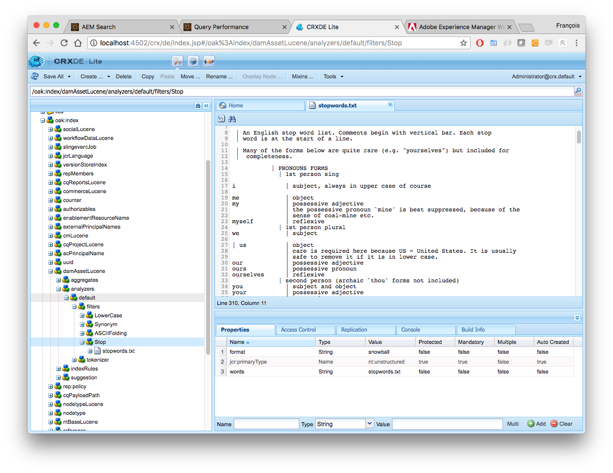
7. Verify searching `the`, `before` or `must` terms doesn't return any result anymore

### Stemming Filter
Stemming converts user-provided search words into their linguistic “root” thereby intelligently expanding the scope of the full-text search.

Stemming is used at both index time and query time. At index time, stemmed terms (rather than full terms) are stored in the full text index. At query time, the user provided search terms are stemmed and passed in as the full-text term.

For example
* Given the provided term: developing
* The stemmer will derive the root word: develop 
* Which includes content that contains derived forms such as “developer” and “development”

#### :computer: Configuration
1. Verify searching `pants` works and `pant` doesn't 
2. Open the */oak:index/damAssetLucene/analyzers/default/filters* node in [CRXDE Lite](http://localhost:4502/crx/de/index.jsp#/oak%3Aindex/damAssetLucene/analyzers/default/filters) 
3. Add node name `PorterStem` of type *nt:unstructured*

4. Save changes and re-index **damAssetLucene**
5. Verify searching `pants` and `pant` is equivalent
6. Verify searching `run` and `running` is equivalent
7. Verify searching `disappear`, `disappears`, `disappearing` and `disappeared` is equivalent

#### :computer: Bonus - Fine Tuning
1. Search for `university`. Is the term effectively contained in the Content Fragment ?
2. This behaviour is explained by the fact that *university* and *universally* have the same root, *univers*  
:information_source: We can manage this situation by excluding the term *university* for being processed by the stemmer
3. Add node name `KeywordMarker` of type *nt:unstructured* before the node *PorterStem*
4. On *KeywordMarker* node add property `protected` of type *String* with value `protectedwords.txt`
5. Under *KeywordMarker* node, create a file named `protectedwords.txt`
6. Insert term `university` in *protectedwords.txt*
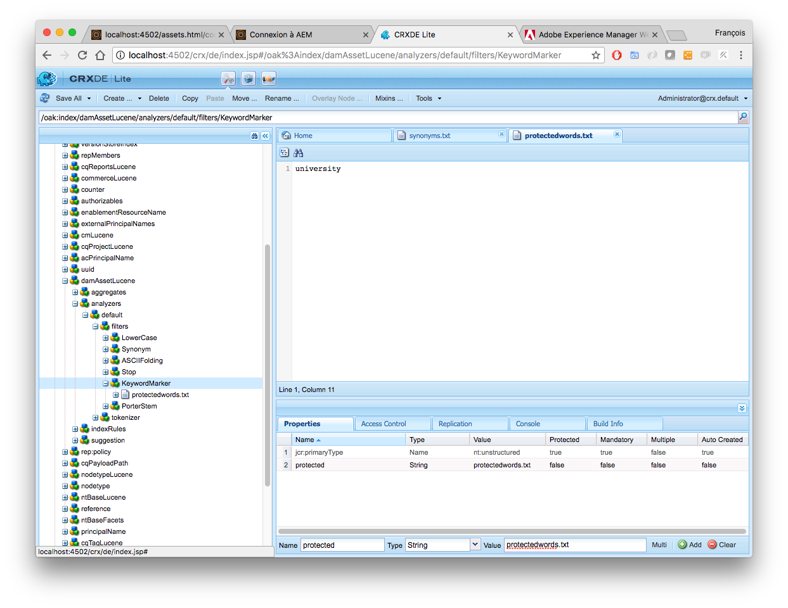
7. Save changes and re-index **damAssetLucene**
8. Verify searching `university` term doesn't return any result anymore

#### :computer: Bonus - Super Fine Tuning

1. Search for term `general`. Is the term always contained in the Content Fragment ?
2. This behaviour is explained by the fact that *general* and *generation* have the same root, *gener*
3. As before, let's first insert terms `general` and `generation` in *protectedwords.txt* (one word by line)  
:information_source: What if we search for `generals` or `generations` ?
4. Add node name `StemmerOverride` of type *nt:unstructured* before the node *PorterStem*
5. On *StemmerOverride* node add property `dictionary` of type *String* with value `dictionary.txt`
6. Under *StemmerOverride* node, create a file named `dictionary.txt`
7. Insert terms `generations	generation` and `generals	general` in *dictionary.txt* (terms are tab-separated)
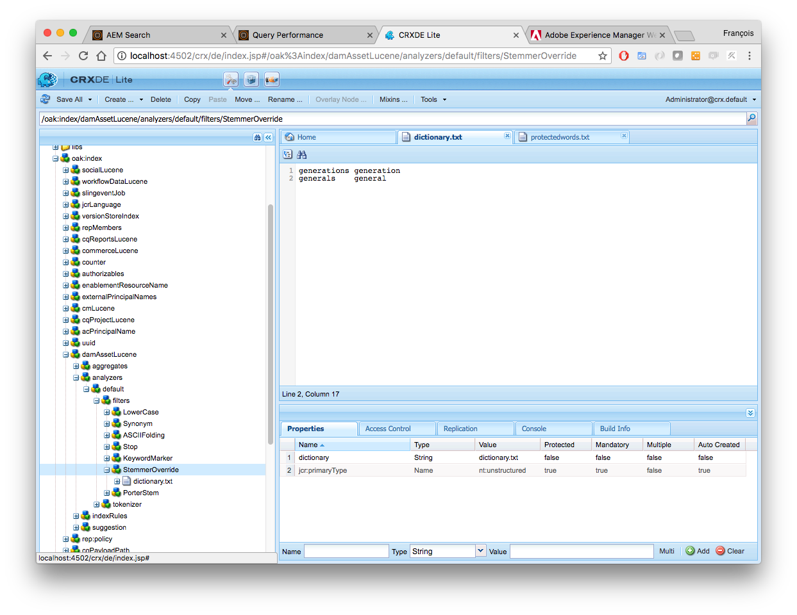
8. Save changes and re-index **damAssetLucene**
9. Verify searching `general`, `generals`, `generation` and `generations` terms is correct

## Chapter 06 - Boosting
Lucene fulltext indexing supports the ability to boost or weight specific metadata properties. This allows specified properties to be ranked higher than others, thus when a search term is found in a boosted property the result is moved up in the search results. 

:information_source: Note Lucene does a decent job of ranking metadata properties as it considers the length of the property when evaluating the result score. A title field is typically shorter than a description and thus search terms found in the title would typically be ranked higher by default.

#### :computer: Boost keywords
1. Perform a search on term `running` and open properties of last image in results
2. Open *Advanced* metadata tab and add `running` item in *Search Promote* fields
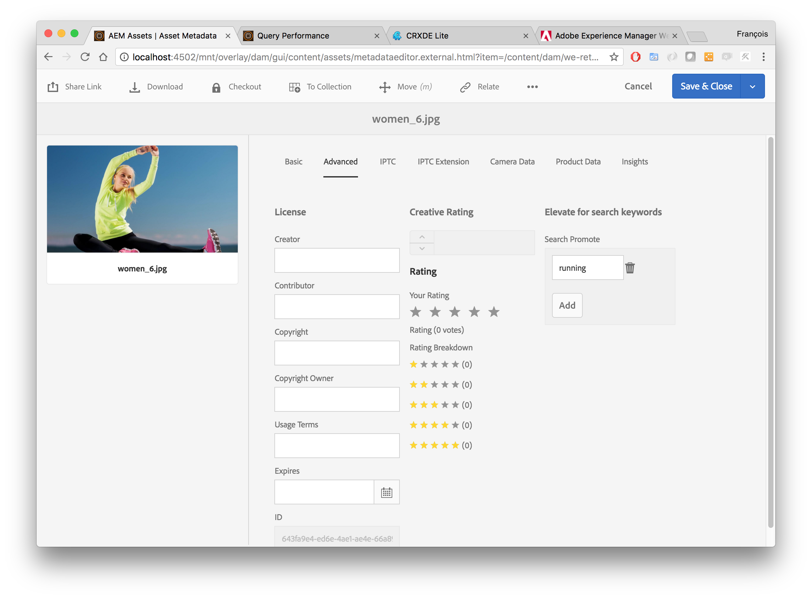
3. Perform again a search on term `running` to validate the change

:information_source: To understand why the asset has a better score, we need to have a look at the **damAssetLucene** index configuration and more specifically to the property where *Search Promote* values are stored. Of course, any other properties can be boosted in index configuration


4. Perform an explain the query on [Query Performance](http://localhost:4502/libs/granite/operations/content/diagnosistools/queryPerformance.html). We can see *jcr:content/metadata/dam:search_promote* property is boosted with a factor of 100 (^100.0)
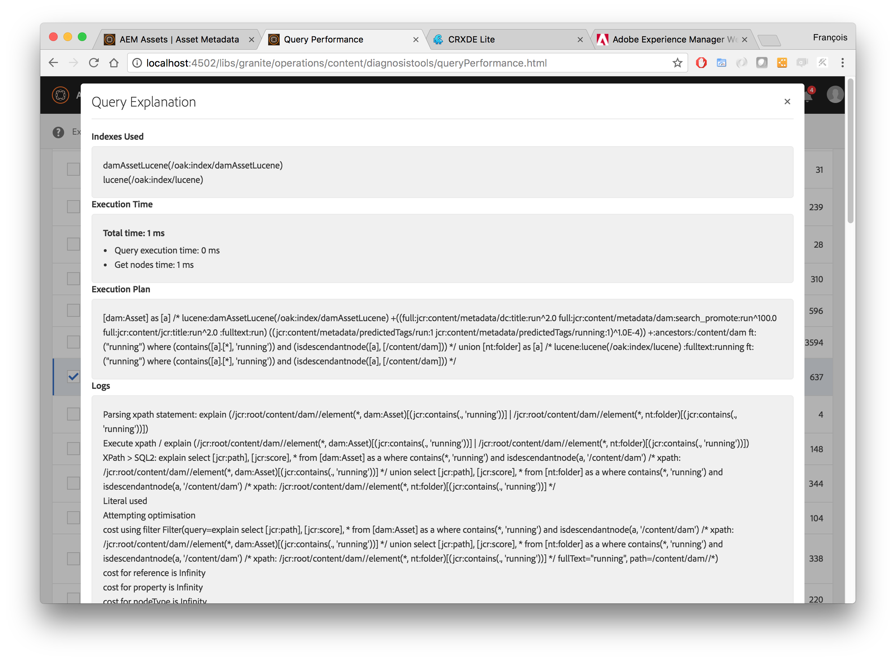

## Chapter 07 - Smart Tags
Smart Tags is a service that makes images more easily discoverable in DAM. One of the biggest challenges we face is a large repository of images of untagged assets. We are making assets more easily discoverable by automatically tagging images using a deep learning based algorithm. 

These tags are then incorporated into search, so that under-tagged images can be found and the search results enriched. The tags (of which there are tens of thousands) are of generic nature (e.g., objects: car, lamp, salmon, subjects: man, woman, group of people, mood: sad, happy, smile, image properties: motion blur, macro, portrait, etc.) and do not contain brands, people identities, etc

#### :computer: Enable Smart Tags
1. [Cloud Service](http://localhost:4502/etc/cloudservices/smarttagging/smart-tags.html) for Smart Tags has already been configured
2. Navigate to AEM > Assets > Files > We.Retail > English > [Activities](http://localhost:4502/assets.html/content/dam/we-retail/en/activities)
3. Select *Hiking* folder properties and enable Smart Tags feature
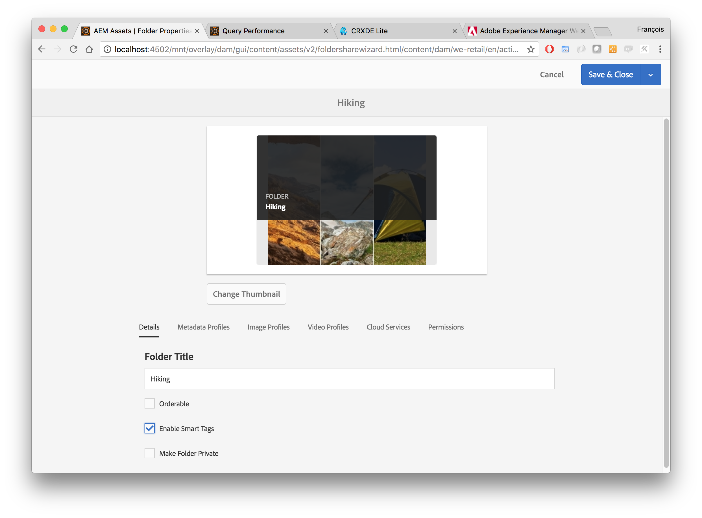
4. Select *Hiking* folder and trigger *DAM Smart Tag Assets* workflow (Create > Workflow)
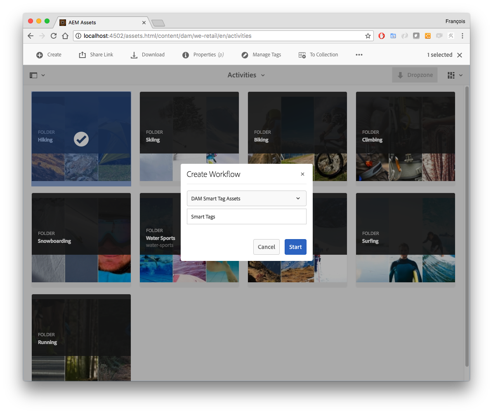
5. Open assets properties and check new smart tags
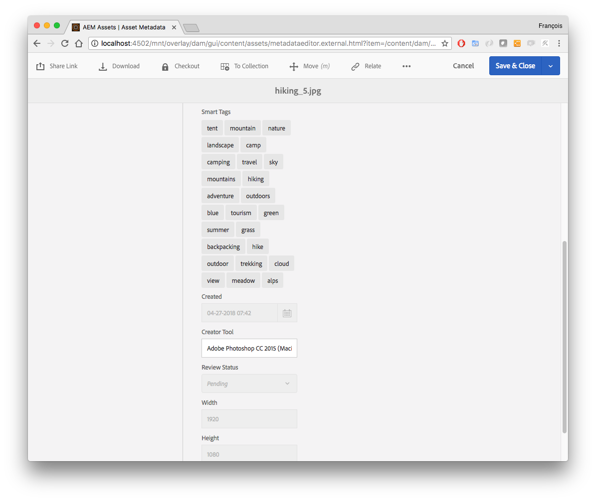
6. Searching term `adventure` or `campsite` now returns images too

:information_source: To automate Smart Tags feature at upload, simply modify *DAM Update Asset* workflow

1. Navigate to AEM > Tools > Workflow > [Models](http://localhost:4502/libs/cq/workflow/admin/console/content/models.html)
2. Add `Smart Tag Asset` step to *DAM Update Asset* workflow after *Process Thumbnails* step
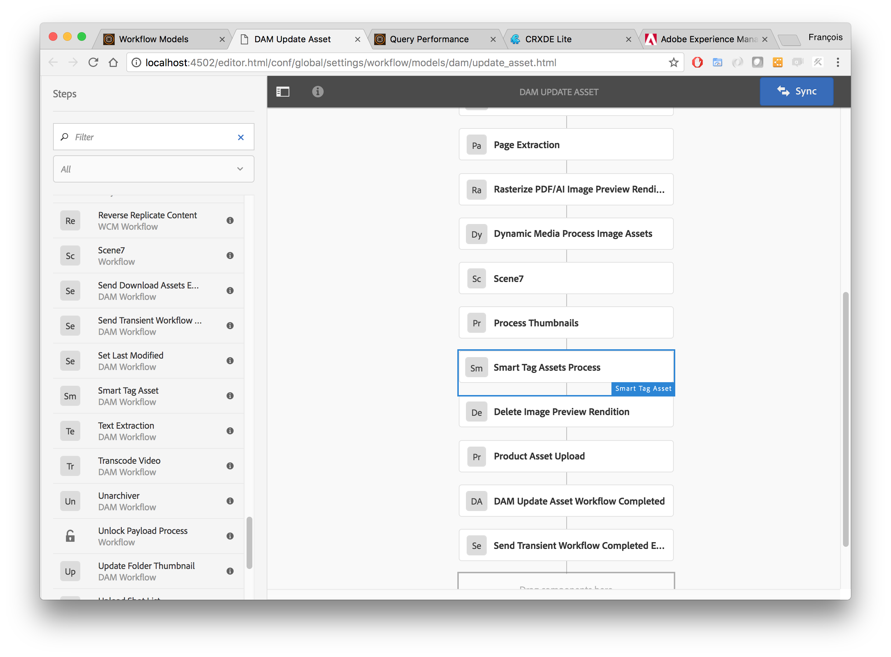
3. Click on **Sync** button
4. Upload this new [image](images/hiking-free.jpeg) in *Hiking* folder

#### :computer: Display confidence score
To display smart tags confidence score, some configurations must be changed as described in [documentation](https://helpx.adobe.com/experience-manager/kt/assets/using/smart-tags-technical-video-setup.html#ShowingSmartTagsscoresforinstructionalpurposes).
1. Open Package Manager in [CRXDE Lite](http://localhost:4502/crx/packmgr/index.jsp) 
2. Install the [Chapter 07 - Smart Tags-1.0.0.zip](resources/Chapter%2007%20-%20Smart%20Tags-1.0.0.zip) package
3. Select one previously processed asset and click on *Manage Tags* or open asset metadata
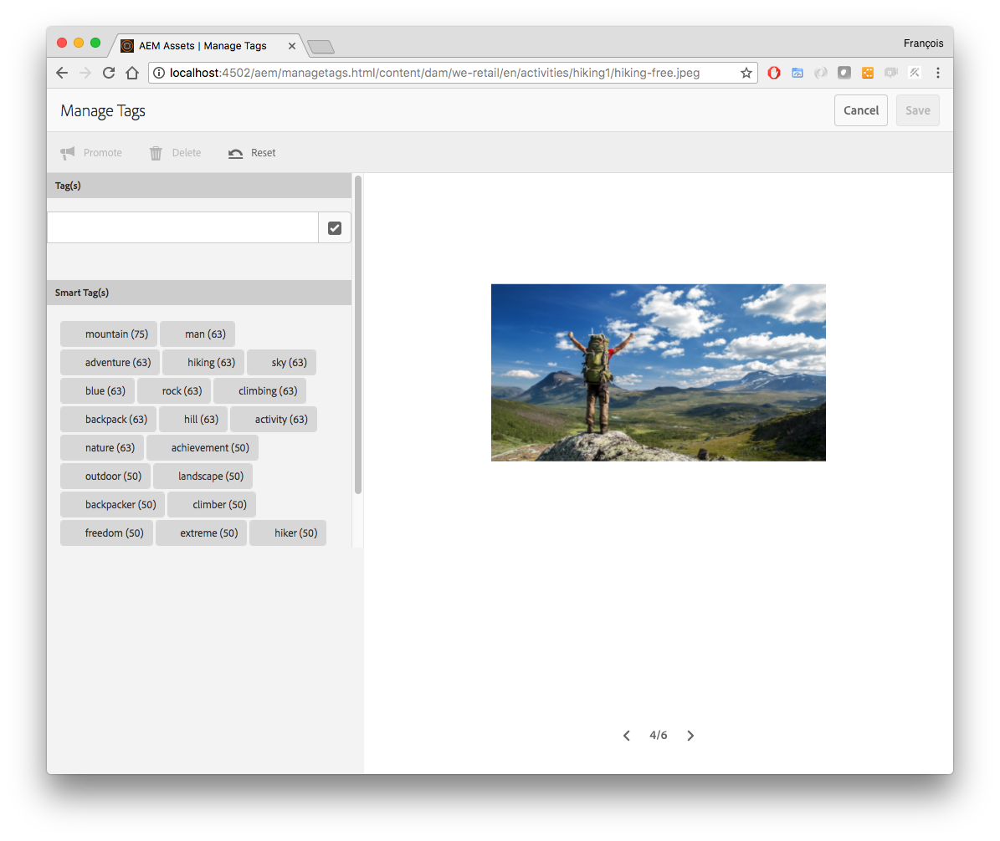

## Chapter 08 - Smart Translation
Large enterprises with operations in different countries wish to enable search in different languages without having to go through costly and time-consuming translation workflows.

Smart Translation Search feature uses machine translation to translate search queries on the fly. It leverages the open source project [Apache Joshua](https://cwiki.apache.org/confluence/display/JOSHUA/Apache+Joshua+%28Incubating%29+Home), which supports more than 50 languages.

#### :computer: Enable Smart Translation
1. Open [OSGi Console](http://localhost:4502/system/console)
2. Install and start the OAK search extension [OSGi bundle](resources/oak-search-mt-1.8.2.jar)
3. Create an OSGi configuration for [Apache Jackrabbit Oak Machine Translation Fulltext Query Terms Provider](http://localhost:4502/system/console/configMgr/org.apache.jackrabbit.oak.plugins.index.mt.MTFulltextQueryTermsProviderFactory)
4. Set Joshua config path to `/Users/tl07/Desktop/aem-6.4-summit-london/apache-joshua-fr-en-2016-11-18/joshua.config`
5. Set node types to `dam:Asset`
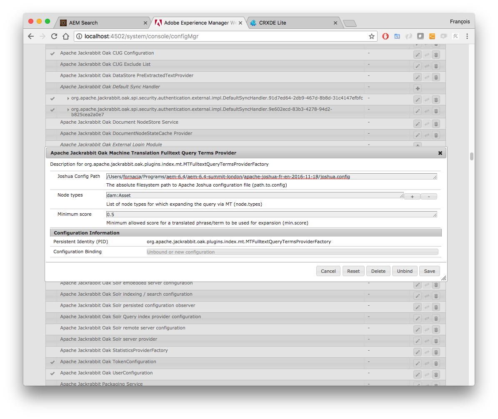
6. Save configuration

:information_source: Here we have just installed the French language pack 

7. Verify that some french terms give now results

| French      | English     |
|-------------|-------------|
| montagne    | mountain    |
| nuage       | cloud       |
| pantalon    | pant        |
| forêt       | forest      |

## Solution Packages
* [Chapter 03 - Suggestions - Solution-1.0.0.zip](resources/Chapter%2004%20-%20Suggestions%20-%20Solution-1.0.0.zip)
* [Chapter 04 - Spellcheck - Solution-1.0.0.zip](resources/Chapter%2004%20-%20Spellcheck%20-%20Solution-1.0.0.zip)
* [Chapter 05 - Analyzers - Solution-1.0.0.zip](resources/Chapter%2004%20-%20Analyzers%20-%20Solution-1.0.0.zip)
* [Chapter 07 - Smart Tags - Solution-1.0.0.zip](resources/Chapter%2004%20-%20Smart%20Tags%20-%20Solution-1.0.0.zip)
* [Chapter 08 - Smart Translation - Solution-1.0.0.zip](resources/Chapter%2004%20-%20Smart%20Translation%20-%20Solution-1.0.0.zip)