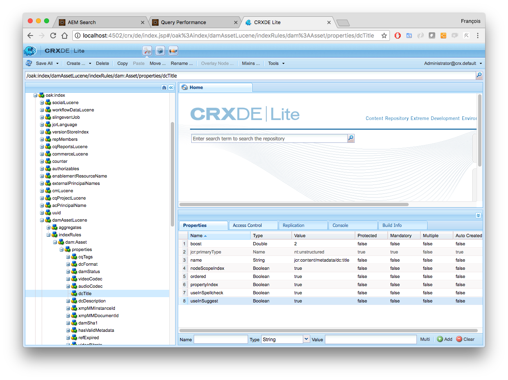

# TL07 - Boost your AEM Search

## Agenda
[Chapter 01 - Boostrap](#chapter-01---bootstrap)  
[Chapter 02 - Search fundamentals](#chapter-02---search-fundamentals)  
[Chapter 03 - Suggestions](#chapter-03---suggestions)  
[Chapter 04 - Spellcheck](#chapter-04---spellcheck)  
[Chapter 05 - Analyzers](#chapter-05---analyzers)  
[Chapter 06 - Boosting](#chapter-06---boosting)  
[Chapter 07 - Smart Tags](#chapter-07---smart-tags)  
[Chapter 08 - Smart Translation](#chapter-08---smart-translation)  
[Chapter 09 - Diagnosis](#chapter-09---diagnosis)  

## Chapter 01 - Bootstrap

### AEM Start
Start AEM by executing the following command  
```java -Xmx6G -jar cq-quickstart-*.jar -nobrowser -nofork```

Using Chrome, log in to AEM Author at http://localhost:4502/
* User name: admin
* Password: admin

### Content package
Install content package which contains some assets.

### Developer Tools
#### Index Manager
Web console that facilitates and reviewing high-level Oak index configurations.
- AEM > Tools > Operations > Diagnosis > [Index Manager](http://localhost:4502/libs/granite/operations/content/diagnosistools/indexManager.html)

#### Query Performance & Explain Query
Web console that lists recent slow and popular queries and provides detailed execution details for a specific query.
- AEM > Tools > Operations > Diagnosis > [Query Performance](http://localhost:4502/libs/granite/operations/content/diagnosistools/queryPerformance.html)

#### :information_source: Re-indexing Oak Indexes via Index Manager
Throughout this lab, re-indexing of the /oak:index/damAssetLucene will be required to make configuration changes to take effect.  

Below are the steps required to re-index the damAssetLucene index.
1. Open the */oak:index/damAssetLucene* node in the [CRXDE Lite](http://localhost:4502/crx/de/index.jsp#/oak%3Aindex/damAssetLucene)
2. Set *reindex* property to `true`
3. Once re-index finished, the *reindex* property value must be equal to **false** and *reindexCount* incremented

## Chapter 02 - Search fundamentals
AEM search supports robust full-text search, provided by the Apache Lucene. 

Lucene property indixes are at the core of AEM Search and must be well understood. This exercise covers:

*	Definition of the OOTB damAssetLucene Oak Lucene property index
*	Search query inspection
*	Full-text search operators

### :computer: Exercise

#### Perform a full-text search on Assets
1. Navigate to AEM > Assets > [File](http://localhost:4502/assets.html/content/dam)
2. Select Filter on the left (Alt+5 shortcut can be used)

3. Filter by Files only (and not Folders) and type the term *mountain*

4. Find the executed query in the **Popular Queries** tab of [Query Performance](http://localhost:4502/libs/granite/operations/content/diagnosistools/queryPerformance.html) 

5. Select the query, click on :question:`Explain` and analyze the execution plan. The plan describes which Oak index will be used to execute this query; in this case the Lucene index named **damAssetLucene** is selected for use.


#### Inspecting the damAssetLucene index definition
1.	Open [CRXDE Lite](http://localhost:4502/crx/de)
2.	Select /oak:index/damAssetLucene node
3.	Core index configurations are on damAssetLucene 
4.	Full-text aggregate configuration are defined under damAssetLucene/aggregates
5.	Property specific configurations are defined under damAssetLucene/indexRules


#### Full-text operations
Try out the following full-text searches using the supported operators and note the changes in results:
1. Group phrases: `mountain biking`
2. Group phrases with using double-quotes: `"mountain biking"`
3. OR operator: `mountain OR biking`
4. AND operator: `mountain AND biking`

## Chapter 03 - Suggestions
Suggestions provide list of terms or phrases that exist in the content and match a user-provided initial search term.  
There are two types of suggestion configurations:
1. Property-based: returns the entire value (multi-word) of a property as a suggested term
2. Aggregate-based: returns a list of single-word terms that match the user-provided search term

### :computer: Exercise
#### Validate search suggestions
1. Navigate to AEM > Assets > [File](http://localhost:4502/assets.html/content/dam)
2. Click on the Search button and enter the term `trail`
3. Verify AEM is providing suggestions for potential matching results

4. In this example, we observe property-based suggestions. *dc:title* and *dc:description* asset properties are configured to provide suggestion inputs. The configuration is done in the *damAssetLucene* index. The boolean property **useInSuggest** must be equal to *true*


#### Configure search suggestions
1. Navigate to AEM > Assets > [File](http://localhost:4502/assets.html/content/dam)
2. Create a folder named `Aviation`
3. Enter this new folder and upload this image: [Big Airliner](images/airline_engine.jpg)
4. Click on the Search button and enter term `airliner`
5. :information_source: We can observe that no suggestions are provided. Indeed, the default update frequency is set to 10 minutes
6. Open [CRXDE Lite](http://localhost:4502/crx/de) and select */oak:index/damAssetLucene node*
7. Create child node `suggestion` of type *nt:unstructured*
8. Add property `suggestUpdateFrequencyMinutes` of type *Long* with value equals to `1` 

9. Select */oak:index/damAssetLucene* node and add property `refresh` of type *Boolean* with value equals to `true`
10. Save changes and refresh the node *damAssetLucene*, we can observe the *refresh* property disappeared
11. After maximum 1 minute, you should see suggestions for term *airliner*

12. Select again */oak:index/damAssetLucene/suggestion* and add property `suggestAnalyzed` of type *Boolean* with value equals to `true`

13. Select */oak:index/damAssetLucene* node and add a property `reindex` of type *Boolean* with value equals to `true`
14. Save changes and refresh the node *damAssetLucene*, once re-index done the *reindex* property value must be equal to **false** and *reindexCount* incremented
15. After maximum 1 minute, you should see aggregate-based suggestions for terms *airliner*, *big* or even *mountain*


#### :information_source: Suggestion query
For getting suggestion terms, the follwing query can be used to retrieve values:
```sql
SELECT rep:suggest() FROM [nt:base] WHERE SUGGEST('ski') AND ISDESCENDANTNODE('/a/b')
```
More informations can be found on [OAK documentation](https://jackrabbit.apache.org/oak/docs/query/query-engine.html#Suggestions)  

## Chapter 04 - Spellcheck
## Chapter 05 - Analyzers
## Chapter 06 - Boosting
## Chapter 07 - Smart Tags
## Chapter 08 - Smart Translation
## Chapter 09 - Diagnosis
